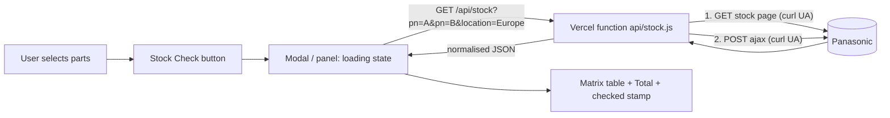

# Panasonic Stock Check — Implementation Playbook

Reusable across any Panasonic **selection tool** (inductors, capacitors, resistors, …).
The part numbers are the only thing that differs between tools — the proxy is generic.

> **Reuse in a new tool:** paste the single prompt in [§7](#7-the-one-prompt-copy-paste).
> Everything Panasonic-specific lives in `api/stock.js`, which takes part numbers as a
> query parameter, so **no changes are needed for a different product family**.

---

## 0. TL;DR

- Panasonic's stock search is a Drupal form whose results come from an AJAX endpoint that
  sends **no CORS headers** → a static site cannot call it from the browser.
- A tiny **Vercel serverless function** (`api/stock.js`) does the two-step call server-side
  and returns normalised JSON. It is **product-agnostic**: you pass `?pn=<part number>`.
- The UI is a **matrix table**: rows = part numbers, columns = distributors (in a fixed
  priority order), cells = quantity (hyperlinked to the distributor's purchase page),
  plus a **Total** column and a `EU stock checked: DD.MM.YYYY` stamp.
- Duplicate listings from the same distributor are merged (largest quantity kept).
- ⚠️ **The one thing that will break it:** Panasonic sits behind Akamai, which **rejects
  requests with no `User-Agent`**. Vercel's `fetch` sends none by default → HTTP 502.
  Fix: send `User-Agent: curl/8.4.0` ([§3.1](#31-akamai-user-agent-rules-the-critical-gotcha)).

---

## 1. What the feature looks like

**Main page:** a **Stock Check** button in the selection bar (right after *Farnell*).
Clicking it checks the currently selected part numbers and opens a dialog:

```
┌ Distributor stock   Region [Europe ▾]   Refresh   ✕ ┐
│ EU stock checked: 07.10.2026                        │
│                                                     │
│ Panasonic PN  Farnell  TTI  Rutronik  RS  Schukat … │
│ ETQP8MR68JFA  —        —    250       494 100    …  │
│ ETQP3MR68KVP  3,590    —    —         —   3,995  …  │
│                          …        Total EU Stock    │
│ ETQP8MR68JFA                      845                │
│ ETQP3MR68KVP                      7,643              │
└─────────────────────────────────────────────────────┘
```

> The **Farnell** column header is tinted green to match the Farnell button.

**Export window (optional):** a *Distributor stock* region selector + *Check Stock* button,
checking every part number currently in the exported table.

---

## 2. How Panasonic's stock check works (reverse-engineered)

### 2.1 Base

| Thing | Value |
|---|---|
| Stock page | `https://industrial.panasonic.com/ww/stock-search` |
| Platform | Drupal 10 behind Akamai |
| Auth | **None** — no session cookie required |

### 2.2 Step 1 — get a form token

```
GET https://industrial.panasonic.com/ww/stock-search
→ scrape:  name="form_build_id" value="form-XXXXXXXX..."
```

### 2.3 Step 2 — ask for stock

```
POST https://industrial.panasonic.com/ww/stock-search/ajax?_wrapper_format=drupal_ajax
Headers:
  Content-Type:   application/x-www-form-urlencoded
  X-Requested-With: XMLHttpRequest
  Accept:         application/json
  User-Agent:     curl/8.4.0        ← REQUIRED, see §3.1
Body (form-encoded):
  model=<part number>
  type=1|2|3
  location=Asia|Europe|North America
  form_build_id=<token from step 1>
  form_id=stock_search_conditions_form
  _triggering_element_name=btn_stock_search
  _triggering_element_value=Stock Check
```

| Parameter | Values |
|---|---|
| `type` | `1` = Exact, `2` = Begins With, `3` = Contains |
| `location` | `Asia`, `Europe`, `North America` |

### 2.4 Response

A Drupal AJAX **JSON array** of commands. The HTML you want is in the command whose
`selector === "#stock-search-results"`:

```json
[
  { "command": "settings", "...": "..." },
  { "command": "add_js", "selector": "body", "data": [ ... ] },
  { "command": "insert", "method": "replaceWith",
    "selector": "#stock-search-results",
    "data": "<div id=\"stock-search-results\">…<table>…</table></div>" }
]
```

Inside `data` is a table with these columns:

| # | Column | Notes |
|---|---|---|
| 0 | Panasonic part number | may differ slightly in punctuation from your query |
| 1 | Stock | value is in `span.tablesaw-cell-content` (the cell also repeats a mobile label) |
| 2 | Buy or Sample | `<a href="…">` → distributor purchase page |
| 3 | Distributor | e.g. `Farnell, An Avnet Company` |
| 4 | Location | e.g. `Europe` |
| 5 | Date | e.g. `10/07/2026` |
| 6 | Product details | `<a href="…">` |

### 2.5 Status markers

| Marker | Meaning |
|---|---|
| `#inv-search-find-stock` | `Search completed.` |
| `#inv-search-no-stock` | `Inventory is not found.` |

### 2.6 Coverage caveat

Not every series is stocked through this tool. In testing, many automotive inductors
(`ETQP…`) returned *Inventory is not found*, while capacitors/inductors in other families
returned rows. Always report "no stock" honestly rather than showing an error.

---

## 3. Why the browser can't do this directly

| Blocker | Detail | Consequence |
|---|---|---|
| **CORS** | The AJAX endpoint returns **no `Access-Control-Allow-Origin`** | Browser `fetch` from another origin is blocked |
| **CSP** | `frame-ancestors 'self'` | The page cannot be embedded in an `<iframe>` |
| **No deep link** | Results only render via the tokenised AJAX POST | You can't pre-fill a URL and let the user click |

➡️ Therefore: **a server-side proxy is mandatory.** On Vercel, any file in `/api` becomes a
serverless function automatically (no build step needed).

### 3.1 Akamai User-Agent rules (THE critical gotcha)

Panasonic's WAF fingerprints the `User-Agent` (and TLS). Empirically:

| User-Agent | Result |
|---|---|
| `curl/8.4.0`, `Wget/1.21.3`, `python-requests/2.31.0`, `axios/1.6.0` | ✅ 200 |
| **no `User-Agent` at all** | ❌ blocked (request times out) |
| empty `User-Agent:` header | ❌ blocked |
| arbitrary UA (e.g. `MyTool/1.0`) | ❌ blocked |
| `node`, `undici` | ❌ blocked |
| spoofed Chrome UA from a non-browser client | ❌ blocked (TLS mismatch) |

**Why it fails on Vercel:** Node's `fetch` (undici) sends **no `User-Agent`** by default, so
every request is dropped and the function returns **502**.

**Fix:** send a curl-style UA on **both** requests:

```js
const REQUEST_HEADERS = {
  "User-Agent": "curl/8.4.0",
  "Accept-Language": "en-US,en;q=0.9"
};
```

> Do **not** switch this to a browser UA — Akamai blocks browser UAs whose TLS fingerprint
> doesn't match. Also note this is a workaround for their bot protection; it may change.

---

## 4. Architecture



| File | Role |
|---|---|
| `api/stock.js` | Serverless proxy + normalisation (generic, copy verbatim) |
| `app.js` | Button wiring + shared renderer (`buildStockTableHtml`, `buildStockMetaHtml`, helpers) |
| `styles.css` | Modal + matrix table styling |
| `index.html` | `#stockCheckButton`, `#stockModal` markup |
| Export-window template (in `app.js`) | Optional second entry point; reuses the shared renderer |

The export window is a **separate document**, so the shared renderer functions are injected
into its template via `` ${fn.toString()} `` — one implementation, two surfaces.

---

## 5. API reference — `GET /api/stock`

```
GET /api/stock?location=Europe&type=1&pn=ETQP3MR47KVP&pn=ETQP5MR33YLC
```

| Param | Required | Default | Notes |
|---|---|---|---|
| `pn` | ✅ | — | Repeat for multiple parts (deduped, capped at `MAX_PARTS`) |
| `location` | — | `Europe` | `Asia` \| `Europe` \| `North America` |
| `type` | — | `1` | `1` Exact \| `2` Begins With \| `3` Contains |

Response `200`:

```json
{
  "location": "Europe",
  "type": "1",
  "checkedAt": "2026-10-07T12:00:00.000Z",
  "distributors": ["Farnell", "TTI", "Rutronik", "RS", "Schukat"],
  "results": {
    "ETQP8MR68JFA": {
      "partNumber": "ETQP8MR68JFA",
      "found": true,
      "error": null,
      "total": 845,
      "rows": [
        { "distributor": "Rutronik", "stock": "250", "quantity": 250, "buyUrl": "https://…" },
        { "distributor": "RS",       "stock": "494", "quantity": 494, "buyUrl": "https://…" }
      ]
    },
    "ETQP3MR68KVN": { "partNumber": "ETQP3MR68KVN", "found": false, "error": null, "total": 0, "rows": [] }
  }
}
```

Errors: `400` (no `pn`), `405` (non-GET), `502` (upstream blocked/unreachable — includes
`error`, `code`, `step`, `hint`).

---

## 6. Presentation rules

### 6.1 Distributor priority

Columns are ordered by this list (unknown sellers appended afterwards, alphabetically):

```
Farnell → Arrow → Avnet → Future → TTI → Rutronik → Gudeco → Schukat → TME → RS → Mouser → DigiKey → others
```

### 6.2 Dedupe + totals

- Canonicalise the distributor name (alias map, **first match wins**, so
  `Farnell, An Avnet Company` → **Farnell**).
- Collapse to **one row per distributor per part**, keeping the **largest quantity**
  (Panasonic sometimes repeats the same listing, e.g. `RS 494` ×3 → **494**, not 1,482).
- `total` per part = sum of the kept per-distributor quantities.

Verified example (matches the source data exactly):

| PN | Farnell | TTI | Rutronik | RS | Schukat | TME | Anglia | Total |
|---|---|---|---|---|---|---|---|---|
| ETQP8MR68JFA | — | — | 250 | 494 | 100 | — | 1 | **845** |
| ETQP3MR68KVP | 3,590 | — | — | — | 3,995 | 50 | 8 | **7,643** |
| ETQP3MR68KVN | — | 4,000 | — | — | — | — | — | **4,000** |

### 6.3 Layout

- Meta line above the table: `EU stock checked: DD.MM.YYYY` (region label `EU` / `NA` / `Asia`).
- Header row: `Panasonic PN` | one `<th>` per distributor | `Total <region> Stock`.
- Cells: quantity as a link to `buyUrl`, otherwise `—`; numeric cells right-aligned.
- Each distributor `<th>` gets a class `stock-col-<slug>` so individual vendors can be
  accented. Farnell is green (matching the Farnell button) but keeps the **same neutral
  borders as the other cells**:
  ```css
  .stock-table.stock-matrix thead th.stock-col-farnell {
    background: rgba(16, 150, 80, 0.1);
    color: #0a7a3f;
  }
  ```

---

## 7. The one prompt (copy-paste)

> Replace the `{{…}}` placeholders. Works whether or not the tool has an export window.

```text
Add a "Stock Check" feature to this Panasonic selection tool.

DATA SOURCE
- Part numbers come from {{PART_NUMBER_SOURCE}} (e.g. `state.selected`, or
  `mainRows.map(r => r.pn)`). Default search mode: Exact (type=1), region: Europe.

BACKEND (create api/stock.js, copy verbatim from the appendix of
STOCK-CHECK-PLAYBOOK.md — it is product-agnostic and needs no changes)
- GET /api/stock?location=Europe&type=1&pn=A&pn=B → normalised JSON.
- It proxies Panasonic's stock search in two steps (GET page for `form_build_id`,
  then POST /ww/stock-search/ajax?_wrapper_format=drupal_ajax).
- CRITICAL: it MUST send `User-Agent: curl/8.4.0` on both requests, otherwise
  Akamai blocks it (Vercel's fetch sends no UA → HTTP 502).
- Response shape: { location, type, checkedAt, distributors[], results: { [pn]:
  { found, error, total, rows: [{ distributor, stock, quantity, buyUrl }] } } }

UI — main page
- Add a `Stock Check` button in the selection bar, immediately after the Farnell
  button (id="stockCheckButton", disabled when nothing is selected).
- Clicking it opens a modal dialog (`#stockModal`) with:
  a small muted line "{{REGION_LABEL}} stock checked: DD.MM.YYYY" above a matrix
  table, a region <select> (Europe default / North America / Asia) and Refresh.
- Matrix table: rows = the part numbers in selection order; columns = one per
  distributor ordered by PRIORITY below; last column = "Total {{REGION_LABEL}} Stock".
  Cell = quantity hyperlinked to buyUrl, else "—". Escape all values.
- Close on ✕, backdrop click and Escape. Show the server's error text if the
  request fails (read the JSON `error`/`code` fields, don't just show the status).
- The API URL must be absolute: new URL("api/stock", window.location.href).href

{{OPTIONAL_EXPORT_WINDOW}}
- Also add a "Distributor stock" region <select> + "Check Stock" button to the
  export window toolbar, checking every part number in the exported table and
  rendering the same matrix table into a collapsible panel.

SHARED RENDERER (avoid duplicated logic)
- Implement `buildStockTableHtml(payload, order)` and `buildStockMetaHtml(payload)`
  once in app.js, and inject their source into the export window template with
  `${fn.toString()}` so both surfaces stay identical.
- Write them with string concatenation only (no template literals), so the
  injection is safe.

DISTRIBUTOR PRIORITY
Farnell, Arrow, Avnet, Future, TTI, Rutronik, Gudeco, Schukat, TME, RS, Mouser,
DigiKey, then unknown sellers alphabetically.

DEDUPE
Cache the server-side: canonicalise distributor names (aliases, first match wins)
and keep the LARGEST quantity per distributor per part; total = sum of those.

STYLING
- Matrix table with sticky header, right-aligned numeric cells, bold Total column,
  horizontal scroll wrapper, and a green Farnell header (bg rgba(16,150,80,.1),
  color #0a7a3f) that keeps the same neutral borders as the other cells.
- Modal z-index must exceed the sidebar (use 300).

SEE STOCK-CHECK-PLAYBOOK.md §8 for the gotcha checklist before you finish.
```

---

## 8. Gotchas checklist (learned the hard way)

| # | Symptom | Cause | Fix |
|---|---|---|---|
| 1 | `HTTP 502` on Vercel (works locally) | Akamai blocks requests with **no `User-Agent`**; undici sends none | Send `User-Agent: curl/8.4.0` on **both** requests |
| 2 | Browser `fetch` fails with CORS | Endpoint sends no `Access-Control-Allow-Origin` | Use the serverless proxy (never call Panasonic from the client) |
| 3 | Works locally (`file://`) fails on deploy, or vice-versa | Relative URL resolved against `about:blank` | Always compute `new URL("api/stock", window.location.href).href` |
| 4 | `Identifier 'x' has already been declared` in the export window | **Test artifact** only: `page.setContent()` reuses the app's global scope while the app's own `const`s are live | Navigate to `about:blank` first; real export windows are separate documents |
| 5 | Same distributor listed 3× (e.g. RS ×3) | Panasonic repeats listings | Canonicalise + keep max per distributor |
| 6 | Selected-part pills hidden behind the action bar | The bar grew (extra button) but the pills were pinned at a fixed `bottom` | Put **both** in one fixed flex column container; don't re-add `position: fixed` to the children |
| 7 | Stock table header forced blue/white and sticky | Global results-table rules `thead th:nth-child(1\|2) { background: #f0f5ff !important; }` leaked to **all** tables | Scope them to `#resultsTable` |
| 8 | Modal appears behind the sidebar | Sidebar uses `z-index` up to 100 at some widths | Give the modal `z-index: 300` |
| 9 | Function times out with many parts | Vercel function time budget | Cap parts (`MAX_PARTS = 25`), concurrency `5`, per-request timeout `7s` |
| 10 | "Inventory is not found" for a whole family | Coverage gap in Panasonic's tool | Show it honestly; don't treat it as an error |
| 11 | Results look stale after edits | Browser cached JS | Hard-reload before testing |
| 12 | Legal/ToS | This scrapes Panasonic's stock page | Confirm it's acceptable for your use; keep it low-volume and cached |

---

## 9. Deploy & verify

**Deploy**
1. Push to GitHub, connect to Vercel. The `/api` folder is deployed as serverless
   functions automatically — no build command required.
2. `api/stock.js` must be a **CommonJS** module (`module.exports = async (req, res) => {}`).

**Debug the upstream directly** (proves the UA + flow work outside your app):

```bash
UA="curl/8.4.0"; P=https://industrial.panasonic.com/ww/stock-search
BID=$(curl -sS -A "$UA" "$P" | grep -o 'name="form_build_id" value="[^"]*"' | head -1 | sed 's/.*value="//;s/"$//')
curl -sS -A "$UA" -H "Content-Type: application/x-www-form-urlencoded" \
  -H "X-Requested-With: XMLHttpRequest" \
  --data-urlencode "model=EEHZC1V470P" --data-urlencode "type=1" \
  --data-urlencode "location=Europe" --data-urlencode "form_build_id=$BID" \
  --data-urlencode "form_id=stock_search_conditions_form" \
  --data-urlencode "_triggering_element_name=btn_stock_search" \
  --data-urlencode "_triggering_element_value=Stock Check" \
  "$P/ajax?_wrapper_format=drupal_ajax" | head -c 400
```

**Verify in the UI**
- [ ] Button sits after *Farnell*, disabled with no selection.
- [ ] Modal opens; region switch re-queries (`location=…` in the request).
- [ ] Matrix has `Panasonic PN` first, distributors in priority order, `Total … Stock` last.
- [ ] Distributor repeated once only; Total equals the sum of visible cells.
- [ ] Numbers link to the distributor's purchase page; blanks show `—`.
- [ ] Meta line shows `EU stock checked: DD.MM.YYYY`.
- [ ] Farnell header is green with neutral borders like the other cells; other headers are neutral.
- [ ] ✕ / backdrop / Escape all dismiss; errors show the server's message.
- [ ] Export window (if used) renders the identical table.

---

## Appendix A — `api/stock.js` (copy verbatim)

```js
/**
 * Panasonic distributor stock check — Vercel serverless proxy.
 *
 * Panasonic's stock search (https://industrial.panasonic.com/ww/stock-search)
 * is a Drupal form whose results are fetched from an AJAX endpoint that sends
 * no CORS headers, so a static site cannot call it directly. This function
 * performs the two-step flow server-side and returns JSON.
 *
 *   1. GET  /ww/stock-search                -> scrape `form_build_id`
 *   2. POST /ww/stock-search/ajax?_wrapper_format=drupal_ajax
 *
 * Notes:
 *  - No session cookie is required; a token from a fresh GET is enough.
 *  - Panasonic sits behind Akamai, which rejects requests that arrive with NO
 *    User-Agent (Vercel's fetch/undici sends none by default), blocks agent
 *    names such as "node"/"undici", and blocks spoofed browser UAs (TLS
 *    fingerprint mismatch). Allow-listed clients (curl, Wget, python-requests,
 *    axios) pass, so we send a curl-style User-Agent. See REQUEST_HEADERS.
 *
 * Usage: GET /api/stock?location=Europe&type=1&pn=ETQP3MR47KVP&pn=ETQP5MR33YLC
 *   location: Asia | Europe | North America   (default Europe)
 *   type:     1 = Exact | 2 = Begins With | 3 = Contains   (default 1)
 */

const ORIGIN = "https://industrial.panasonic.com";
const SEARCH_PAGE = ORIGIN + "/ww/stock-search";
const AJAX_URL = ORIGIN + "/ww/stock-search/ajax?_wrapper_format=drupal_ajax";

const MAX_PARTS = 25;
const CONCURRENCY = 5;
const REQUEST_TIMEOUT_MS = 7000;

const REQUEST_HEADERS = {
  "User-Agent": "curl/8.4.0",
  "Accept-Language": "en-US,en;q=0.9"
};

const ALLOWED_LOCATIONS = ["Asia", "Europe", "North America"];
const ALLOWED_TYPES = ["1", "2", "3"];

// Preferred column order. Sellers outside this list are appended afterwards
// (alphabetically) rather than being dropped.
const DISTRIBUTOR_PRIORITY = [
  "Farnell", "Arrow", "Avnet", "Future", "TTI", "Rutronik",
  "Gudeco", "Schukat", "TME", "RS", "Mouser", "DigiKey"
];

// First match wins, so "Farnell, An Avnet Company" resolves to Farnell.
const DISTRIBUTOR_ALIASES = [
  ["Farnell", /farnell/i],
  ["Arrow", /arrow/i],
  ["Avnet", /avnet/i],
  ["Future", /future/i],
  ["TTI", /\btti\b/i],
  ["Rutronik", /rutronik/i],
  ["Gudeco", /gudeco/i],
  ["Schukat", /schukat/i],
  ["TME", /\btme\b|transfer\s+multisort/i],
  ["RS", /rs[\s-]?components|rs[\s-]?online|radiospares|\brs\b/i],
  ["Mouser", /mouser/i],
  ["DigiKey", /digi[\s-]?key/i]
];

function decodeEntities(value) {
  return String(value)
    .replace(/&nbsp;/gi, " ")
    .replace(/&amp;/gi, "&")
    .replace(/&lt;/gi, "<")
    .replace(/&gt;/gi, ">")
    .replace(/&quot;/gi, '"')
    .replace(/&#0*39;/g, "'");
}

function toText(html) {
  return decodeEntities(String(html).replace(/<[^>]*>/g, " "))
    .replace(/\s+/g, " ")
    .trim();
}

// Prefer the value inside .tablesaw-cell-content (the cell also contains a
// duplicate mobile label such as "Stock").
function cellText(html) {
  const match = /class="tablesaw-cell-content"[^>]*>([\s\S]*?)<\/span>/i.exec(html);
  return toText(match ? match[1] : html);
}

function firstHref(html) {
  const match = /href="([^"]+)"/i.exec(html);
  return match ? decodeEntities(match[1]) : null;
}

function parseResults(dataHtml) {
  const noStock = /inv-search-no-stock/.test(dataHtml);
  const rows = [];
  const tbody = /<tbody[^>]*>([\s\S]*?)<\/tbody>/i.exec(dataHtml);

  if (tbody) {
    const trRe = /<tr[^>]*>([\s\S]*?)<\/tr>/gi;
    let tr;
    while ((tr = trRe.exec(tbody[1])) !== null) {
      const cells = [];
      const tdRe = /<td[^>]*>([\s\S]*?)<\/td>/gi;
      let td;
      while ((td = tdRe.exec(tr[1])) !== null) cells.push(td[1]);
      if (cells.length < 5) continue;

      rows.push({
        partNumber: cellText(cells[0]),
        stock: cellText(cells[1]),
        buyUrl: firstHref(cells[2]),
        distributor: cellText(cells[3]),
        location: cellText(cells[4]),
        date: cells[5] ? cellText(cells[5]) : "",
        detailsUrl: cells[6] ? firstHref(cells[6]) : null
      });
    }
  }

  return {
    status: noStock ? "Inventory is not found." : "Search completed.",
    found: rows.length > 0,
    rows
  };
}

function normaliseDistributor(name) {
  const value = String(name == null ? "" : name).trim();
  if (!value) return "Unknown";
  for (let i = 0; i < DISTRIBUTOR_ALIASES.length; i += 1) {
    if (DISTRIBUTOR_ALIASES[i][1].test(value)) return DISTRIBUTOR_ALIASES[i][0];
  }
  return value;
}

function stockQuantity(value) {
  const digits = String(value == null ? "" : value).replace(/[^0-9]/g, "");
  return digits ? Number(digits) : 0;
}

// Collapse a part's listings to one entry per distributor, keeping the largest
// quantity (Panasonic sometimes repeats the same distributor listing).
function collapseByDistributor(rows) {
  const byDistributor = new Map();
  rows.forEach((row) => {
    const distributor = normaliseDistributor(row.distributor);
    const quantity = stockQuantity(row.stock);
    const existing = byDistributor.get(distributor);
    if (!existing || quantity > existing.quantity) {
      byDistributor.set(distributor, {
        distributor,
        distributorName: row.distributor,
        stock: row.stock,
        quantity,
        buyUrl: row.buyUrl,
        location: row.location,
        date: row.date,
        detailsUrl: row.detailsUrl
      });
    }
  });
  return Array.from(byDistributor.values());
}

function orderDistributors(names) {
  return names.slice().sort((a, b) => {
    const ia = DISTRIBUTOR_PRIORITY.indexOf(a);
    const ib = DISTRIBUTOR_PRIORITY.indexOf(b);
    if (ia === -1 && ib === -1) return a.localeCompare(b);
    if (ia === -1) return 1;
    if (ib === -1) return -1;
    return ia - ib;
  });
}

async function fetchWithTimeout(url, options) {
  const controller = new AbortController();
  const timer = setTimeout(() => controller.abort(), REQUEST_TIMEOUT_MS);
  try {
    return await fetch(url, Object.assign({}, options, { signal: controller.signal }));
  } finally {
    clearTimeout(timer);
  }
}

async function getFormBuildId() {
  const response = await fetchWithTimeout(SEARCH_PAGE, {
    headers: Object.assign({ Accept: "text/html" }, REQUEST_HEADERS)
  });
  if (!response.ok) throw new Error("Stock page returned HTTP " + response.status);

  const html = await response.text();
  const match = /name="form_build_id" value="([^"]+)"/.exec(html);
  if (!match) throw new Error("Could not read the stock-search form token.");
  return match[1];
}

async function queryPart(partNumber, buildId, location, type) {
  const body = new URLSearchParams({
    model: partNumber,
    type: type,
    location: location,
    form_build_id: buildId,
    form_id: "stock_search_conditions_form",
    _triggering_element_name: "btn_stock_search",
    _triggering_element_value: "Stock Check"
  });

  const response = await fetchWithTimeout(AJAX_URL, {
    method: "POST",
    headers: Object.assign({
      "Content-Type": "application/x-www-form-urlencoded",
      "X-Requested-With": "XMLHttpRequest",
      Accept: "application/json"
    }, REQUEST_HEADERS),
    body: body.toString()
  });

  if (!response.ok) {
    return { partNumber, found: false, error: "HTTP " + response.status, rows: [] };
  }

  const text = await response.text();
  let commands;
  try {
    commands = JSON.parse(text);
  } catch (err) {
    return { partNumber, found: false, error: "Unexpected response from Panasonic.", rows: [] };
  }

  const command = Array.isArray(commands)
    ? commands.find((entry) => entry && entry.selector === "#stock-search-results")
    : null;

  if (!command || typeof command.data !== "string") {
    return { partNumber, found: false, error: "No stock results returned.", rows: [] };
  }

  const parsed = parseResults(command.data);
  return { partNumber, found: parsed.found, status: parsed.status, rows: parsed.rows };
}

module.exports = async (req, res) => {
  res.setHeader("Access-Control-Allow-Origin", "*");
  res.setHeader("Access-Control-Allow-Methods", "GET, OPTIONS");

  if (req.method === "OPTIONS") {
    res.status(204).end();
    return;
  }
  if (req.method !== "GET") {
    res.status(405).json({ error: "Method not allowed." });
    return;
  }

  const rawPns = req.query.pn;
  const requested = (Array.isArray(rawPns) ? rawPns : rawPns ? [rawPns] : [])
    .map((value) => String(value).trim())
    .filter(Boolean);

  const parts = Array.from(new Set(requested)).slice(0, MAX_PARTS);

  if (parts.length === 0) {
    res.status(400).json({ error: "Provide at least one part number via ?pn=." });
    return;
  }

  const location = ALLOWED_LOCATIONS.includes(req.query.location) ? req.query.location : "Europe";
  const type = ALLOWED_TYPES.includes(String(req.query.type)) ? String(req.query.type) : "1";

  try {
    const buildId = await getFormBuildId();
    const raw = {};
    const queue = parts.slice();

    const worker = async () => {
      while (queue.length > 0) {
        const partNumber = queue.shift();
        try {
          raw[partNumber] = await queryPart(partNumber, buildId, location, type);
        } catch (err) {
          raw[partNumber] = {
            partNumber,
            found: false,
            error: err && err.name === "AbortError" ? "Request timed out." : (err && err.message) || "Request failed.",
            rows: []
          };
        }
      }
    };

    await Promise.all(
      Array.from({ length: Math.min(CONCURRENCY, parts.length) }, () => worker())
    );

    // Collapse duplicate distributor listings and derive the column order.
    const results = {};
    const distributorSet = new Set();

    parts.forEach((partNumber) => {
      const entry = raw[partNumber] || { found: false, rows: [] };

      if (entry.error || !entry.found) {
        results[partNumber] = {
          partNumber,
          found: false,
          error: entry.error || null,
          total: 0,
          rows: []
        };
        return;
      }

      const rows = collapseByDistributor(entry.rows);
      rows.forEach((row) => distributorSet.add(row.distributor));

      results[partNumber] = {
        partNumber,
        found: rows.length > 0,
        error: null,
        total: rows.reduce((sum, row) => sum + row.quantity, 0),
        rows
      };
    });

    // Cache at the edge so repeated checks stay light on Panasonic.
    res.setHeader("Cache-Control", "s-maxage=300, stale-while-revalidate=600");
    res.status(200).json({
      location,
      type,
      checkedAt: new Date().toISOString(),
      distributors: orderDistributors(Array.from(distributorSet)),
      results
    });
  } catch (err) {
    const code = (err && err.cause && err.cause.code) || (err && err.code) || null;
    res.status(502).json({
      error: (err && err.message) || "Stock check failed.",
      code,
      step: "upstream",
      hint:
        "The proxy could not reach Panasonic's stock page. " +
        "A 403/timeout usually means the request was blocked upstream."
    });
  }
};
```

---

## Appendix B — shared renderer (copy into `app.js`)

Written with **string concatenation only** (no template literals) so the source can be
injected into the export window with `${fn.toString()}`.

```js
function escapeHtml(value) {
  return String(value == null ? "" : value).replace(/[&<>"']/g, (character) => ({
    "&": "&amp;", "<": "&lt;", ">": "&gt;", '"': "&quot;", "'": "&#39;"
  }[character]));
}

function stockRegionLabel(location) {
  if (location === "North America") return "NA";
  if (location === "Asia") return "Asia";
  return "EU";
}

function stockFormatDate(iso) {
  const date = iso ? new Date(iso) : new Date();
  if (isNaN(date.getTime())) return "";
  const day = String(date.getDate()).padStart(2, "0");
  const month = String(date.getMonth() + 1).padStart(2, "0");
  return day + "." + month + "." + date.getFullYear();
}

function buildStockMetaHtml(payload) {
  const location = (payload && payload.location) || "Europe";
  return (
    '<span class="stock-meta">' +
    escapeHtml(stockRegionLabel(location)) +
    " stock checked: " +
    escapeHtml(stockFormatDate(payload && payload.checkedAt)) +
    "</span>"
  );
}

function buildStockTableHtml(payload, order) {
  const results = (payload && payload.results) || {};
  const distributors = (payload && payload.distributors) || [];
  const location = (payload && payload.location) || "Europe";
  const label = stockRegionLabel(location);
  const parts = order || [];

  if (parts.length === 0) {
    return '<div class="stock-empty">No part numbers to check.</div>';
  }

  let html =
    '<div class="stock-matrix-scroll"><table class="stock-table stock-matrix"><thead><tr>' +
    '<th class="stock-pn-col">Panasonic PN</th>';
  distributors.forEach((name) => {
    const columnClass = "stock-col-" + String(name).toLowerCase().replace(/[^a-z0-9]+/g, "-");
    html += '<th class="' + columnClass + '">' + escapeHtml(name) + "</th>";
  });
  html += '<th class="stock-total-col">Total ' + escapeHtml(label) + " Stock</th></tr></thead><tbody>";

  parts.forEach((pn) => {
    const result = results[pn] || {};
    const byDistributor = {};
    (result.rows || []).forEach((row) => {
      byDistributor[row.distributor] = row;
    });

    html += '<tr><td class="stock-pn-col">' + escapeHtml(pn) + "</td>";
    distributors.forEach((name) => {
      const cell = byDistributor[name];
      if (cell && cell.quantity > 0) {
        const text = escapeHtml(cell.stock || String(cell.quantity));
        html +=
          '<td class="stock-cell-num">' +
          (cell.buyUrl
            ? '<a href="' + escapeHtml(cell.buyUrl) + '" target="_blank" rel="noopener noreferrer">' + text + "</a>"
            : text) +
          "</td>";
      } else {
        html += '<td class="stock-cell-num stock-dash">&mdash;</td>';
      }
    });
    const total = typeof result.total === "number" ? result.total : 0;
    html +=
      '<td class="stock-cell-num stock-total">' +
      (total > 0 ? total.toLocaleString("en-US") : "&mdash;") +
      "</td></tr>";
  });

  html += "</tbody></table></div>";

  const failed = parts.filter((pn) => results[pn] && results[pn].error);
  if (failed.length > 0) {
    html +=
      '<div class="stock-error">Could not check: ' +
      failed.map((pn) => escapeHtml(pn)).join(", ") +
      "</div>";
  } else if (distributors.length === 0) {
    html += '<div class="stock-empty">No distributor stock found.</div>';
  }

  return html;
}
```

**Fetch + error surfacing** (always show the server's message, not just the status):

```js
fetch(stockApiUrl() + "?" + params.toString())
  .then((response) => {
    if (!response.ok) {
      return response.json().catch(() => null).then((body) => {
        const detail = body && body.error ? body.error : "HTTP " + response.status;
        throw new Error(detail + (body && body.code ? " [" + body.code + "]" : ""));
      });
    }
    return response.json();
  })
  .then((data) => { body.innerHTML = buildStockTableHtml(data, pns); })
  .catch((error) => { body.innerHTML = '<div class="stock-error">' + escapeHtml(error.message) + '</div>'; });
```

---

## Appendix C — CSS class names

| Class | Purpose |
|---|---|
| `.stock-modal`, `.stock-modal-dialog`, `.stock-modal-head`, `.stock-modal-body` | Dialog shell (`z-index: 300`) |
| `.stock-meta` | The `EU stock checked: …` line |
| `.stock-matrix-scroll` | Horizontal scroll wrapper |
| `.stock-table.stock-matrix` | Matrix table (sticky header, nowrap) |
| `.stock-pn-col` / `.stock-total-col` / `.stock-total` | PN + Total columns (Total bold) |
| `.stock-cell-num` | Right-aligned tabular numbers |
| `.stock-dash` | The `—` placeholder |
| `.stock-col-<slug>` | Per-distributor header hook (`.stock-col-farnell` = green bg + text, neutral borders) |
| `.stock-empty`, `.stock-loading`, `.stock-error` | State messages |

> Copy these rules from `styles.css` **and** from the export-window `<style>` block —
> the export window is a separate document and does not inherit `styles.css`.
